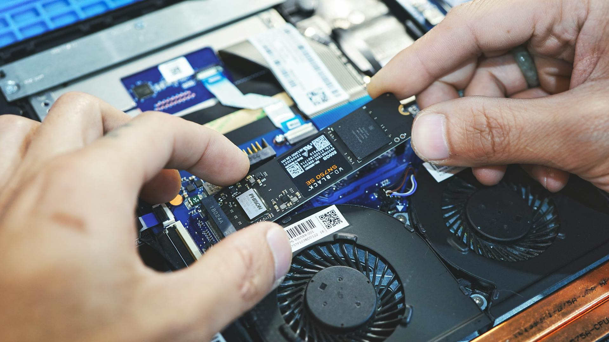

# oem-ssd-info
Database containing performance metrics for various OEM SSDs 

###### What is an OEM SSD?

 
An OEM SSD is custom-made by a company for use in other manufacturers' products like laptops, desktops, or servers. Sold in bulk, they're not directly available to consumers. Manufacturers often do not give detailed information (such as read and write speeds) about these SSDs on their websites as these SSDs are meant for integration into other devices by OEMs. This repo is intended to help everyone with comprehensive insights into their SSDs, including crucial details like read and write speeds, interface specifications, and more.

## List

### SK Hynix

 - [SK Hynix HFM512GD3JX013N 512GB (ASUS TUF Gaming A15 FA506IC-HN005W)](./benchmarks/sk_hynix/SK%20Hynix%20HFM512GD3JX013N/README.md)
 - [SK Hynix HFM512GD3JX016N 512GB (Acer Aspire 7 Gaming A715-42G)](./benchmarks/sk_hynix/SK%20Hynix%20HFM512GD3JX016N/README.md)
