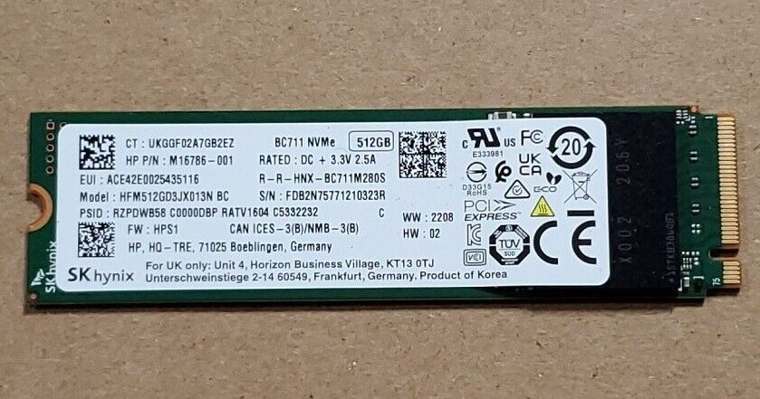
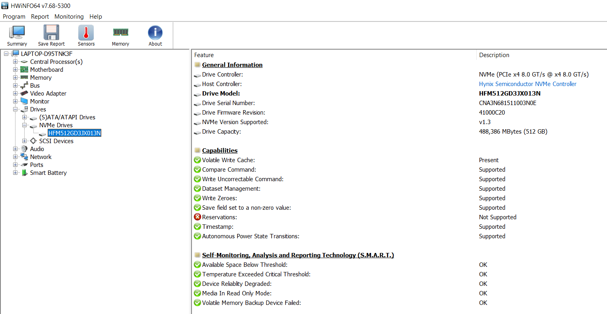

# SK Hynix HFM512GD3JX013N

## Drive Details

## Test System
**Device Type (Desktop/Laptop):** Laptop
 **Device Name:** ASUS TUF Gaming A15 FA506IC-HN005W
 **CPU:** AMD Ryzen 7 4800H (8c/16t, up to 4.2GHz)
 **GPU:** Nvidia Geforce RTX 3050 4GB
 **RAM (Speed and Type):** 8GB (8GB X 1) 3200MHz DDR4
 **Primary Drive:** SK Hynix HFM512GD3JX013N
 **Operating System:** Windows 10 Home Edition 22H2
 **Link to buy the device:** [Amazon](https://www.amazon.in/dp/B09RQKK6CZ)

## Synthetic Benchmarks

### CrystalDiskMark

](crystaldiskmark.png)

In CrystalDiskMark benchmark for NVMe SSDs (Settings->NVMe SSD), the sequential read and write speeds were around 3500MB/s and 1200MB/s respectively, whereas the random read and write speeds were around 500MB/s and 270MB/s respectively. Since this is an OEM SSD, there are no advertised read and write speeds on the device manufacturer's website.

To better understand CrystalDiskMark benchmarks and how you can perform this benchmark on your own drive, checkout [this video](https://www.youtube.com/watch?v=JI8QS74Xz38)

## Relevant Links:
 - Official Website: OEM SSD, no information available on manufacturer's website, visit official [SK Hynix Website](https://ssd.skhynix.com/).
 - [Ebay](https://www.ebay.com/itm/126277870270?itmmeta=01HPPMQ0HSXYRF81M45DYQJMGR&hash=item1d66bf62be:g:zrkAAOSwjdhloFPQ&itmprp=enc%3AAQAIAAAA8DiHbfaDYxG89kMHjJ5OdjsCpgIOF4K3yNDz4FXvr3%2FW%2FlXMgB9fRo3z%2F9Snb3lee4UHVyVXPUdr6uVqZeSNAVPllwjaeE9C3GlngWykC9mACVLtOATpb%2Fwjtie7TmrlDU7eUxrhyzLa4vetCboWIohkKKyKIK9hsNKeT3Z4OT%2FUvqMg4QijmIV%2FCEaen%2BLQT%2Fx2e5wnlbpnr6of15moqZ9fTmHFaH3FH8%2BsBV0liiG2n7ejVdaEijHTbHrhyyN6SoxWO0MJHcjuxHK7aj%2BiID3ww0u3pMDwjMWsoHCRJr9Bhq2jZcAQHLuIOSlODh3Fsw%3D%3D%7Ctkp%3ABFBM-ojc1LVj)

You can visit the official SK Hynix website [here](https://ssd.skhynix.com/)
