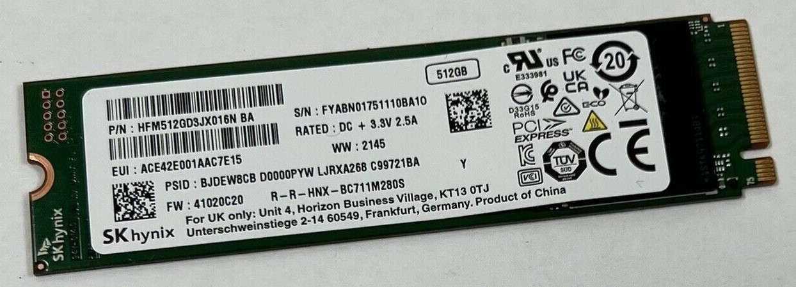
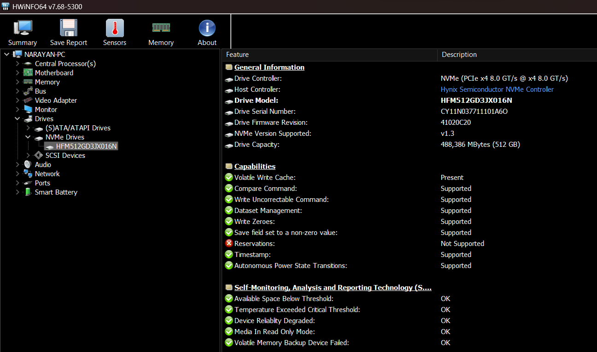
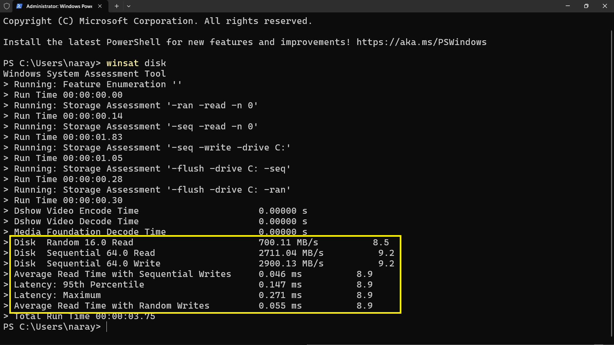

# SK Hynix HFM512GD3JX016N

## Drive Details

## Test System

|                                           |                                                                                                                                           |
|-------------------------------------------|-------------------------------------------------------------------------------------------------------------------------------------------|
| **Device Type (Laptop/Desktop/Handheld)** | Laptop                                                                                                                                    |
| **Device Name**                           | Acer Aspire 7 Gaming A715-42G                                                                                                             |
| **CPU**                                   | AMD Ryzen 5 5500U with Radeon Graphics (6c/12t, upto 4.00GHz)                                                                             |
| **GPU**                                   | Nvidia Geforce GTX 1650 4GB                                                                                                               |
| **RAM**                                   | 16GB (8GB X 2) 3200MHz DDR4                                                                                                               |
| **Primary Storage**                       | SK Hynix HFM512GD3JX016N 512GB                                                                                                            |
| **Secondary Storage (if any)**            | Seagate ST500LM030-2E717D (using SATA to USB converter)                                                                                   |
| **Operating System**                      | Windows 11 Home  23H2 Build 22631.3296                                                                                                                    |
| **Link to buy the device**                | [Official Website Link](https://store.acer.com/en-in/laptops/gaming/acer-aspire7-gaming-laptop-amd-ryzen5-5500u-a715-42g-nvidia-gtx-1651) |

## Synthetic Benchmarks

### CrystalDiskMark (NVMe SSD)

To better understand CrystalDiskMark benchmarks and how you can perform this benchmark on your own drive, checkout [this video](https://www.youtube.com/watch?v=JI8QS74Xz38)

### Winsat

To know more about Winsat, checkout [this video](https://www.youtube.com/watch?v=WQtMwOkaQLg).

### ATTO Benchmark

[Click here](https://drive.google.com/file/d/1CO9HdjIZOMQv9eEuds7fPiyCJ6zjos9z/view?usp=sharing) to download the results in a BMK file.

### AS SSD

[Click Here](https://drive.google.com/file/d/17RcVJ7rpCVRppKBu4MkSCY8aM4rwiKiB/view?usp=sharing) to download the results in an XML file.

### AS SSD (Copy)

### AS SSD (Compression)

[Click here](https://drive.google.com/file/d/1RFh1YJEFpet1y4V1m9cd6_Hseh2m5sIp/view?usp=sharing) to download the results in a CSV file.

[Click here](https://www.techspot.com/downloads/6014-as-ssd-benchmark.html) to download and know more about AS SSD benchmark.

## Relevant Links:
 - Official Website: OEM SSD, no information available on manufacturer's website, visit official [SK Hynix Website](https://ssd.skhynix.com/).
 - [Ebay](https://www.ebay.com/sch/i.html?_from=R40&_nkw=SK+Hynix+HFM512GD3JX016N&_sacat=0)

You can visit the official SK Hynix website [here](https://ssd.skhynix.com/)
