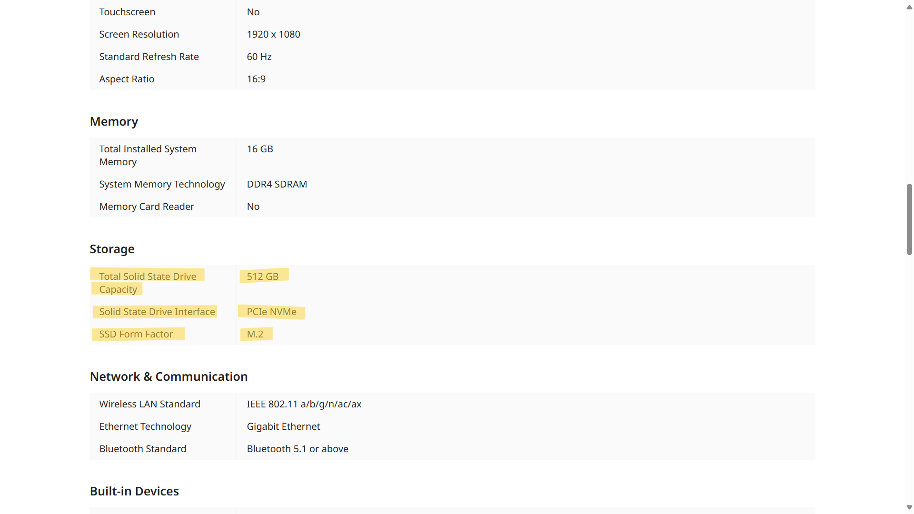
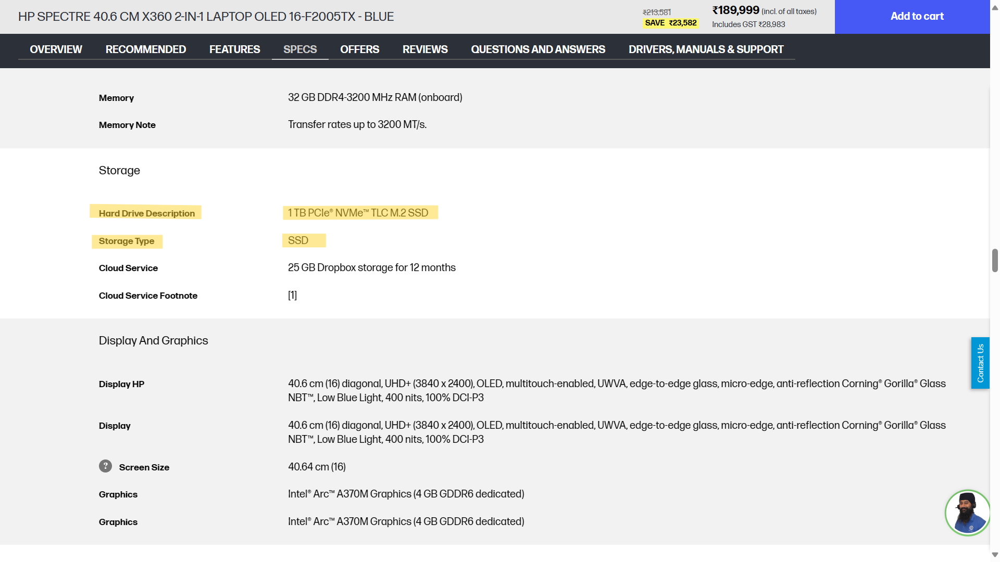
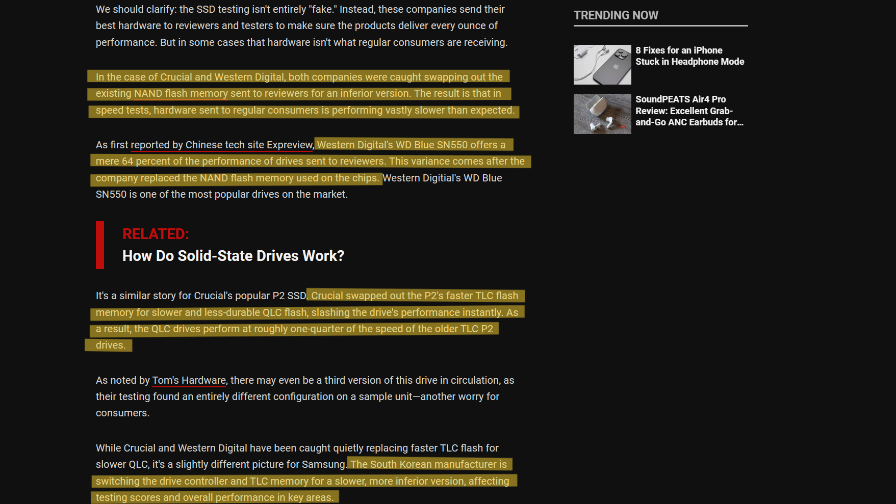

## Our goal
Computer manufacturers, especially laptop makers, rarely advertise the speed of the SSDs they put in their systems. They only advertise the storage, interface, and other technical specifications that may not be easily understood by the average buyer. Very rarely do they include information such as SSD performance on the product listing. For example, if you search for a laptop on [Amazon](amazon.com), you won't find the SSD speed mentioned anywhere.

.png>)
.png>) 
.png>)

You'll also rarely find the SSD speed mentioned on the product page, even on the official website. For example, the  [Acer Aspire 7 A715-42G-R4TV official listing on their website](https://store.acer.com/en-us/aspire-7-laptop-a715-42g-r8bg) doesn't provide much detail about the SSD beyond storage, form factor, and interface.

Similarly, the [HP Spectre 16-F2005TX official listing](https://www.hp.com/in-en/shop/hp-spectre-x360-2-in-1-laptop-16-f2005tx-7y6u9pa.html) doesn't mention the SSD speed. 

Sometimes manufacturers often use SSDs from different Original Equipment Manufacturers(OEMs) even for the same device model due to reasons such as cost-cutting, chip shortages, fluctuating demands, etc.

Even [off-the-shelf SSDs can be affected by unethical practices](https://www.makeuseof.com/how-manufacturers-cheat-on-ssd-speed-tests/), such as bait and switch, used by some companies. This can lead to their performance falling significantly short of advertised levels. Therefore, we also test off-the-shelf SSDs on custom test benches and report any discrepancies we find.

**Hence, the goal is to offer people an option to look up the speed of the SSDs in their system using a combination of synthetic and real-world benchmarks. This will give them a rough idea of their SSD's performance.**

